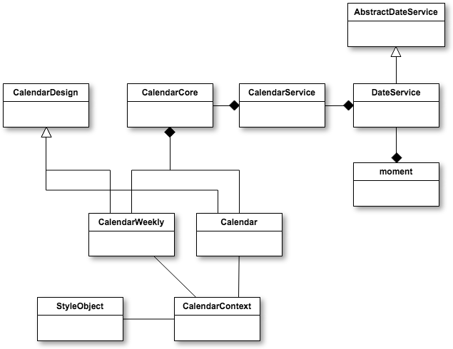

# Smartface Calendar Component
[](https://www.npmjs.com/package/@smartface/sf-component-calendar)

## Component Architecture


## Component Intallation
``` $ npm i @smartface/sf-component-calendar ```
## Component Usage
```js 

const Calendar = require("@smartface/sf-component-calendar/components/Calendar");
const myCalendar = new Calendar();

// when user select a date
myCalendar.onDaySelect = function(dateInfo){
  //...
}

// changing calendar date
myCalendar.setSelectedDate({month:2, year:2017, day:12});
```

## Component maintainers (for Smartface Developers)

Create new cloud workspace in the Smartface-Cloud with this repository url. Open Cloud IDE and switch to terminal in the scripts folder. Install dependencies via terminal:

``` 
    $ cd scripts
    $ npm i sf-core
    $ npm i @smartface/styler
    $ npm i moment
    $ npm i moment-hijri
    $ npm i js-base
```

Then run command via terminal on the workspace root for TDD

``` 
  $ npm i 
  $ npm run test:watch
```

and run command to build service layer

``` $npm run dev ```

Finally run commnand on the scripts folder to publish to npm:

``` $ npm publish ```

### Component Elements

The Calendar component is consisted of several elements. Elements are :

  - **calendar**
    - className: .calendar-self
      - **navbar**
        - className: .calendar.header_navbar
          - **prevMonth**:
            - styling id: #calendar_navbar_prevMonth
            - className: .calendar.header_navbar_arrow
          - **nextMonth**:
            - styling id: #calendar_navbar_nextMonth
            - className: .calendar.header_navbar_arrow
          -  **monthLabel**:
              - styling id: #calendar_navbar_monthLabel
              - className: .calendar.header_navbar_monthLabel
      - **calendarDays**:
        - styling id: #calendar_calendarDays
        - className: .calendar.header_dayNames
          - **dayName_0, dayName_1, dayName_2, dayName_3, dayName_4, dayName_5, dayName_6**
            - className: .calendar.header_dayNames_dayName
            - styling id: #calendar_calendarDays_{component name}
      - **calendarBody**
        - styling id: #calendar_calendarBody
        - className: .calendar.body
          - **week1, week2, week3, week4, week5, week6, week7**
            - className: .calendar.weekrow
              - **weekDay1, weekDay2, weekDay3, weekDay4, weekDay5, weekDay6, weekDay7**
                - styling id: #calendar_week(1..4)_weekday(1..7)
                - className: .calendar.day


## Styling

Default style
```js

{
  "#calendar":{
    "&_line2":{ // element support to directly manipulate
      width:160,
      "alignSelf":"FLEX_END"
    }
  },
  ".calendar":{
    "&-self":{
      "backgroundColor":"#FFFFFF",
      "right":0,
      "left":0,
      "top":0,
      "bottom":0,
      "minHeight":300,
      "maxHeight":300,
      "paddingLeft":0,
      "paddingRight":0,
      "positionType":"ABSOLUTE"
    },
    "&_line":{
      "height":1,
      "width":NaN,
      "backgroundColor":"rgba(228,228,228,1)"
    },
    "&_calendarYear":{
      "&_yearLabel":{
        "textColor":"#FF001F"
      }
    },
    ".header":{
      "&_navbar":{
        "&_monthLabel":{
          "textColor":"#1775D0"
        },
        "&_arrow":{
          "flexGrow":1,
          "textColor":"#B1B1B4"
        },
        "&_label":{
          "textColor":"#000000"
        }
      },
      "&_dayNames":{
        "backgroundColor":"#EBEBEB",
        "minHeight":14,
        "maxHeight":NaN,
        "height":NaN,
        "flexGrow":0.2,
        "direction":"LTR",
        "&-lang_ar":{ // language support for Arabic
          "direction":"RTL"
        },
        "&-lang_ar-sa":{ // language support for Saudi Arabic
          "direction":"RTL"
        },
        "&_dayName":{
          "height":NaN,
          "font":{
            "size":10,
            "family":"Arial"
          },
          ".weekday":{
            "textColor":"#000000"
          },
          ".weekend":{
            "textColor":"#808080"
          }
        }
      }
    },
    ".body":{},
    ".weekRow":{
      "backgroundColor":"rgba(0,0,0,0)",
      "maxHeight":40,
      "minHeight":26,
      "direction":"LTR",
      "&-lang_ar-sa":{
        "direction":"RTL"
      },
      "&-lang_ar":{
        "direction":"RTL"
      },
      "&_line":{
        "backgroundColor":"#C0C0C0"
      }
    },
    ".day":{
      "font":{
        "size":14,
        "bold":false,
        "italic":false,
        "family":"Arial"
      },
      "borderWidth":0,
      "borderRadius":13,
      "maxWidth":26,
      "minWidth":26,
      "maxHeight":26,
      "minHeight":26,
      "textColor":"#000000",
      "backgroundColor":"rgba(0,0,0,0)",
      "&-inrange":{
        "textColor":"#000000"
      },
      "&-selected":{
        "borderWidth":0,
        "backgroundColor":"rgba(0,185,255,42)",
        "textColor":"#000000"
      },
      "&-deactiveDays":{
        "borderWidth":0,
        "textColor":"#D6D6D6"
      },
      "&-specialDay":{
        "borderWidth":0,
        "backgroundColor":"#FF9F9F"
      },
      "&-weekend":{
        "borderWidth":0,
        "textColor":"#A3A3A3"
      }
    }
  }
};

```

### Changing Styles

You can override new styles like below

```js
const newMonthLabelColorStyle = {
  ".calendar":{
    ".header":{
      "&_navbar":{
        "&_monthLabel":{
          "textColor":"#F10000"
        }
      }
    }
  }
};
      
const Calendar = require("@smartface/sf-calendar-component/components/Calendar");
const calendar = new Calendar();

// changing calendar month label color to red
calendar.addStyles(newMonthLabelColorStyle);


```

## Api
### Types
#### DateVO
```js
{
  day:Number (1..31), 
  month:Number (1..12), 
  year:Number (1970 or greater)
}
```
#### DateInfoVO
```js
{ 
  localeDate: {
    day: String (1..31),
    month: String (1..12),
    year: String
  },
  date: {
    day: Number (1..12),
    month: Number (1..31),
    year: Number
  },
  dayInfo: {
    weekDay: Number,
    longName: String
    shortName: String
    specialDay: Array.<String>
  },
  monthInfo: {
    longName: String
    shortName: String
  }
}

```

### Calendar Api
***
#### Methods

##### addStyles(styleObject:Object)

Merges specified styles to current styles and updates the component

##### changeCalendar(lang:String="en", type:String="gregorian", specialDays:Object={})

Changes the calendar's type

  **Supported Calendars:**
  - CalendarTypes.HIJRI
  - CalendarTypes.GREGORIAN

 **Supported Languages:**
  - Turkish : "tr"
  - German : "de"
  - French : "fr"
  - Arabic: "ar"
  - Arabic (Saudi): "ar-sa"
  - Dutch : "nl"
   and all languages that are supported by [moment.js](https://github.com/moment/moment/tree/develop/locale)

##### dispose()
Disposes the calendar.

##### nextMonth()
Jumps to the next month

##### now()
Selects today.

##### prevMonth()
Jumps to the previous month

##### setSelectedDate(date:Date|DateVO)
Sets specified date object as the selected date.

##### setDate(date:Date|DateVO)
Sets a date without selection

##### setRangeDates(start:DateVO, end:DateVO)
Creates a range selection in the Calendar

##### selectDay(weekIndex:(0..5), weekDayIndex:(0..6))
Selects a day on the calendar by specified week and day indexes.

#### Events
##### onChange(date:DateInfo) Event
Called when user presses on a day on the calendar. Calendar injects to callback a selected date object is described above.

##### onBeforeMonthChange(date:DateVO)
Triggered before the Calendar month is being changed. And if the eventlistener returns **false** then it makes the month changing to be canceled.

```js
var calendar = new Calendar();
calendar.onBeforeMonthChange = function(date){
  if(date.month < 6)
    return false;
  return true;
}
```

##### onMonthChange(date:DateVO)
Triggered when month is changed by the user.

##### onDaySelect(date:Array.< DateInfoVO >)
Triggered when a day or days range is selected by the user.

##### onRangeSelectionStart(date:DateInfoVO)
Triggered when a day is selected by the user.

##### onRangeSelectionComplete(start:DateInfoVO, end:DateInfoVO)
Triggered when a day is selected by the user.

### CalendarWeekly Api
#### Methods
##### addStyles(styleObject:Object)

Merges specified styles to current styles and updates the component

##### changeCalendar(lang:String="en", type:String="gregorian", specialDays:Object={})

Changes the calendar's type

  **Supported Calendars:**
  - CalendarTypes.HIJRI
  - CalendarTypes.GREGORIAN

 **Supported Languages:**
  - Turkish : "tr"
  - German : "de"
  - French : "fr"
  - Arabic: "ar"
  - Arabic (Saudi): "ar-sa"
  - Dutch : "nl"
   and all languages that are supported by [moment.js](https://github.com/moment/moment/tree/develop/locale)

##### dispose()
Disposes the calendar.

##### nextMonth()
Jumps to the next month

#### nextWeek()
Jumps to the next week. If the week is the last week then jumps to the next month and its first week.

#### prevWeek()
Jumps to the previous week. If the week is the first week then jumps to the previous month and its last week.

##### now()
Selects today.

##### prevMonth()
Jumps to the previous month

##### selectDay(weekIndex:(0..5), weekDayIndex:(0..6))
Selects a day on the calendar by specified week and day indexes.

##### setSelectedDate(date:Date|DateVO)
Sets specified date object as the selected date.

##### setDate(date:Date|DateVO)
Sets a date without selection

#### Events
##### onMonthChange(date:DateVO)
Triggered when month is changed by the user.

##### onDaySelect(date:Array.< DateInfoVO >)
Triggered when a day or days range is selected by the user.

### CalendarCore Api
CalendarCore includes all calendar logic to manage the calendar state and create custom calendars.

#### Methods
##### reset()
##### selectDay()
##### clearSelection()
##### nextWeek()
##### prevWeek()
##### setRangeSelection(start:DateVO, end:DateVO)
##### rangeSelection(weekIndex:number, weekDayIndex:number)
##### startRangeSelection(weekIndex:number, weekDayIndex:number)
##### completeRangeSelection(weekIndex:number, weekDayIndex:number)
##### subscribe(cb:function)
##### unsubscribe(cb:function)
##### now()
##### getWeekDay()
##### getState()
##### setState(state:object)
##### setDate(date:DateVO|Date)
##### setSelectedDate(date:DateVO|Date)
##### changeCalendar(lang:String="en", type:String="gregorian", specialDays:Object={})
##### prevMonth()
